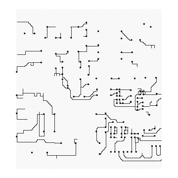

# ReSPack: A Large-Scale Rectilinear Steiner Tree Packing Benchmark for Wire Routing

<table style="text-align:center; margin:auto;">
  <tr>
    <th style="text-align:center; margin:auto;">Real PCB</th>
    <th style="text-align:center; margin:auto;">RSTPP in Real PCB</th>
    <th style="text-align:center; margin:auto;">RSTPP in ReSPack</th>
  </tr>
  <tr>
    <td></td>
    <td></td>
    <td></td>
  </tr>
</table>


Combinatorial optimization (CO) has been studied as a useful tool for modeling industrial problems, but it still remains a challenge in complex domains because of the NP-hardness. With recent advances in machine learning, the field of CO is shifting to the study of neural combinatorial optimization using a large amount of data, showing promising results in some CO problems. Rectilinear Steiner Tree Packing Problem (RSTPP) is a well-known CO problem and is widely used in modeling wiring problem among components in a printed circuit board and an integrated circuit design. Despite the importance for a design automation, the lack of availab le data has restricted to fully leverage machine learning approaches. In this paper, we present ReSPack, a large-scale synthetic RSTPP dataset and a benchmark for wire routing. ReSPack includes a source code for generating RSTPP problems of various types with different sizes, data instances generated for the benchmark testing, and implementations of several baseline algorithms. We believe that ReSPack can contribute to solving circuit design problems as well as the development of CO with machine learning.

<!-- Please refer to the accompanying [paper](https://openreview.net/pdf?id=P14FNX0iotO). -->
You can download ReSPack dataset [here](https://drive.google.com/file/d/1YpnWb5fZHBoQ27fsyY6ZVGPIh484hbnp/view?usp=sharing).

-------------

## Usage

### Setup
```
pip install -r requirements.txt
```

### Example: Generate single instance
```
from steiner import GridSTP2opt, GridSTPfast
stp1 = GridSTP2opt(dim=[10, 10], max_ntrees=2, max_nterminals=[5, 5])
stp1.generate()
stp1.draw_graph(5, 5, save='sample1.png')

stp2 = GridSTPfast(dim=[10, 10], max_ntrees=2, max_nterminals=[5, 5])
stp2.generate()
stp2.draw_graph(5, 5, save='sample2.png')
```


### Example: Generate multiple instances with multiprocessing
```
from distribution import Multinomial
from steiner import DataGenerator
dist1 = Multinomial(vmin=3, vmax=10)
dist2 = Multinomial(vmin=5, vmax=10)
gen = DataGenerator(n=10, method='fast', dim=[10, 10],
                    ntrees=dist1, nterminals=dist2,
                    save_to_dir='samples/', save_plot=True, overwrite=True)
gen.run(ncores=2)
```

### Example: read generated data
```
from graphio import (read_problem_from_file, read_solution_from_file,
draw_graph)

i = 1
path_prob = f"datasets/dataset5/problems/p_{i}.txt"
path_sol = f"datasets/dataset5/solutions/s_{i}.txt"

g = read_problem_from_file(path_prob)
g_sol = read_solution_from_file(g, path_sol)

draw_graph(g_sol, 2, 10, 10, save=f'test.png')
```


### Generate dataset with config file
Prepare your config file for data genaration. 
Sample config files are provided in `dataset_config` (default root directory). 
Then, run the following command.
```
python generate.py --root [ROOT_DIRECTORY] --name [DATASET_NAME] --n_samples [N_SAMPLES] --n_cores [N_CORES] [--init_base_dir [INIT_BASE_DIR]]
```


### Algorithm template
1. Create custom algorithm class
In `custom/custom.py`
```
from common.algorithm import Algorithm

class CustomAlgorithm(Algorithm):
    def __init__(self, **args):
        super().__init__(args)
        # initialize
    
    def run(self):
        ST = STEINER_TREES(=[(EDGE_LIST, NODE_LIST), ...]) if Success else None
        iteration = Number of iteration if exists else 1
        result = {"solution": ST, "iteration": iteration}
        return result
```

2. Add the following code segment 
In `evaluate.py`, `run()` function,
```
from custom.custom import CustomAlgorithm

if arg_algo == "custom":
    algo = CustomAlgorithm(**args)
    file_name = f"{sample_dir}_{arg_algo}_ins{n_samples}_seed{sd}_idx{div+1}"
```

### Evaluate algorithm
Prepare your config file which contains arguments for evaluating algorithm. 
Sample config files are provided in `configs`. 
Then, run the following command.
```
python evaluate.py
```


## Directory
```
ReSPack  
├── dataset_config: config files for dataset generation  
│   |── UC  
│   |── NWA  
│   └── NWA_LS_WL  
│   
├── stppgen: RSTPP generator  
│   └── utils  
│  
├── configs: config files for evaluation  
│  
├── common: common class  
│  
├── MILP: MILP method (OR-Tools)  
│  
├── heuristic: heuristic method (sequential routing)  
│  
├── rankingcost: evolution strategy based routing  
│   └── algorithms: core  
│  
├── generate.py: generate dataset  
└── evaluate.py: evaluate algorithm
```

## License
<a rel="license" href="http://creativecommons.org/licenses/by-nc-sa/4.0/"></a><br />This work is licensed under a <a rel="license" href="http://creativecommons.org/licenses/by-nc-sa/4.0/">Creative Commons Attribution-NonCommercial-ShareAlike 4.0 International License</a>.